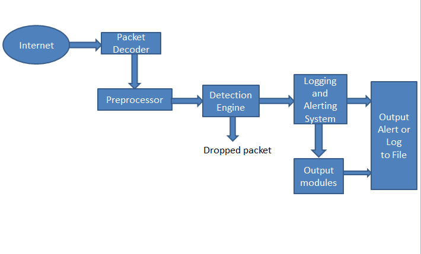

# What is Snort?

Snort is an open-source, free and lightweight network intrusion detection system (NIDS) and intrusion prevention system (IPS)
by CISCO. It provides real-time network traffic analysis and data packet logging. 
Snort is widely used for its flexibility, efficiency, and capability to detect a variety of attacks.

<p align="center">

</p>

In addition, Snort was created by Martin Roesch in 1998 and is now developed by Cisco Systems. It has become one of the most widely deployed intrusion detection/prevention technologies worldwide, with millions of downloads and hundreds of thousands of active users.

- [Snort vs. Traditional IDS/IPS](#snort-vs-traditional-idsips)
- [Snort Architecture](#snort-architecture)
- [Snort Use Cases](#snort-use-cases)
- [Snort Installation](#snort-installation)

# Snort vs. Traditional IDS/IPS

Snort stands out from traditional IDS/IPS solutions in several key ways:

* **Flexibility:** Snort empowers users to craft their own custom rules for tailored detection, unlike many traditional systems that offer limited customization.
* **Cost-Effective Security:** Being open-source, Snort is free to use, making it a highly cost-effective security solution compared to expensive commercial IDS/IPS offerings.
* **Strong Community Backing:** Snort benefits from a large and active community that continually contributes to its development and keeps its rule sets up-to-date.
* **Seamless Integration:** Snort seamlessly integrates with other open-source security tools, enabling you to build a comprehensive and robust security stack.
* **Exceptional Performance:** Snort is known for its high performance and can be optimized for demanding environments, often surpassing commercial counterparts.


# Snort Architecture

Snort's architecture is comprised of several core components that work together seamlessly:
* **Packet Decoder:** Responsible for interpreting packet data received from various network interfaces.
* **Preprocessors:** Prepare the received data for the detection engine by normalizing and reassembling packets.
* **Detection Engine:** The heart of Snort, applying rules to analyze network traffic and identify potential threats.
* **Logging and Alerting System:** Generates alerts and detailed logs based on the findings of the detection engine.
* **Output Modules:** Handle the output of alerts and logs, supporting various formats and destinations.

<p align="center">

</p>

# Snort Use Cases

Snort's versatility makes it suitable for a wide range of security applications, including:

* **Network Security Monitoring:** Providing comprehensive visibility into network traffic for threat detection.
* **Real-time Traffic Analysis:** Enabling immediate identification and response to suspicious network behavior.
* **Forensic Analysis:** Logging packets to disk for detailed post-incident investigation and evidence gathering.
* **Attack Detection:** Detecting a wide array of attacks, including buffer overflows, port scans, cross-site scripting (XSS), and denial-of-service (DoS) attacks.
* **Content Searching & Matching:** Identifying specific patterns or content within network traffic.
* **Malware Detection and Policy Enforcement:** Detecting malware transmission and enforcing network security policies.

# Snort Installation
The installation process for Snort varies depending on your operating system:

1. **Ubuntu/Debian:**

    ```shell
    sudo apt update -y
    sudo apt upgrade -y
    sudo apt install snort 
    ```
   To check whether the installation process is successful, run the following command:
   ```shell
   snort --version
   ```