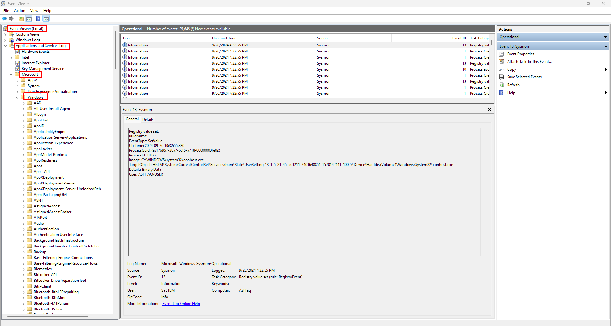

# What is Sysmon?

Sysmon (System Monitor) is a free system monitoring tool developed by Microsoft as part of the Sysinternals suite.
It is designed to log detailed information about system activity to the Windows event log.
Sysmon provides detailed information about process creations, network connections, and changes
to file creation time, making it a powerful tool for system administrators and security professionals.

Furthermore, Sysmon was created by Mark Russinovich and Thomas Garnier at Microsoft. It was first released in 2014 as part of the Sysinternals suite, a set of advanced system utilities for Windows. 
Since its initial release, Sysmon has become an essential tool for Windows system monitoring and security analysis.

# Use Cases of Sysmon

* **Threat Hunting:** Provides detailed logs for investigating potential security incidents.
* **Forensic Analysis:** Offers rich data for post-incident forensic investigations.
* **Compliance Monitoring:** Helps organizations meet regulatory requirements by providing detailed system activity logs.
* **System Troubleshooting:** Assists in diagnosing system issues by providing detailed process and network activity information.
* **Malware Analysis:** Helps in understanding malware behavior by logging detailed system interactions.

# Install Sysmon on your Windows System

1. Download  sysmon exe file and config file from the given link and make sure to download this on the same folder. Configuration file is given below.
[Download all the file](https://download.sysinternals.com/files/Sysmon.zip)
2. Open Power Shell in Administrative mode & run the following command: 
    ```shell
    Sysmon64.exe -accepteula -i sysmonconfig.xml
    ```
3. Here is the configuration file:
[Configuration file](sysmonconfig.xml)

4. Check Whether sysmon is installed or not:
   * In search box, serach "Event Viewer"
   * Then follow the given path: "Applications and Services Logs" -> "Microsoft" -> "Windows" -> "Sysmon" -> "Operational"
   * If you find the path then congratulations you successfully installed sysmon in your system.
   * Here is an image for your better understanding:
   
   <p align="center">
   
   </p>